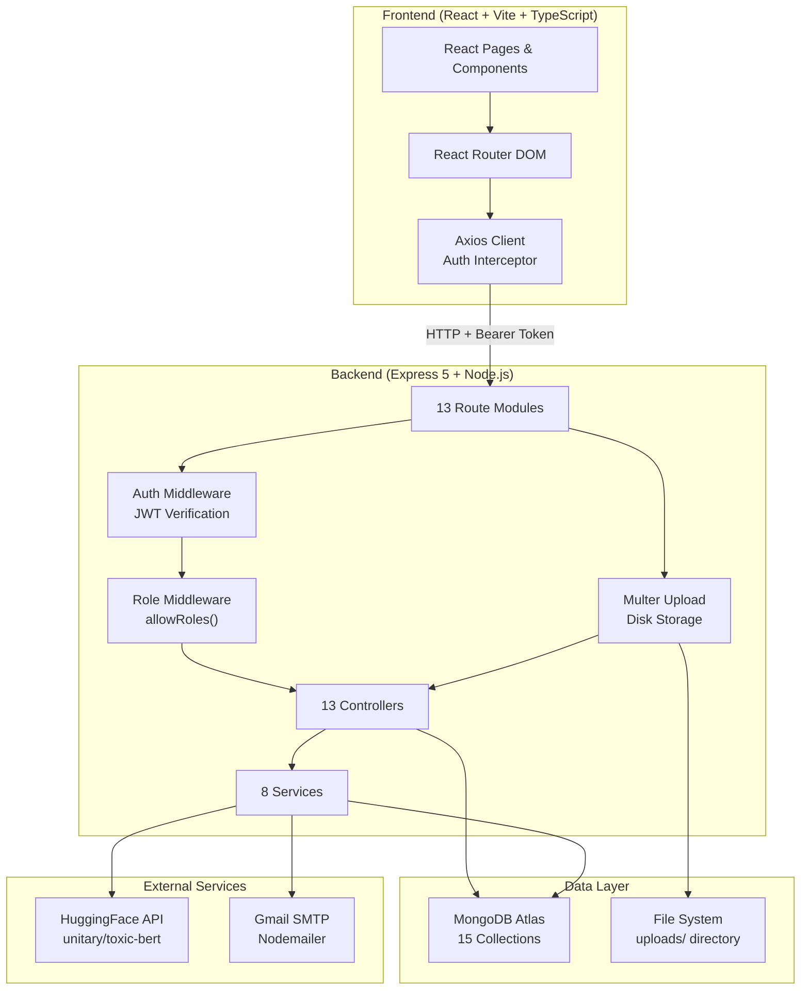
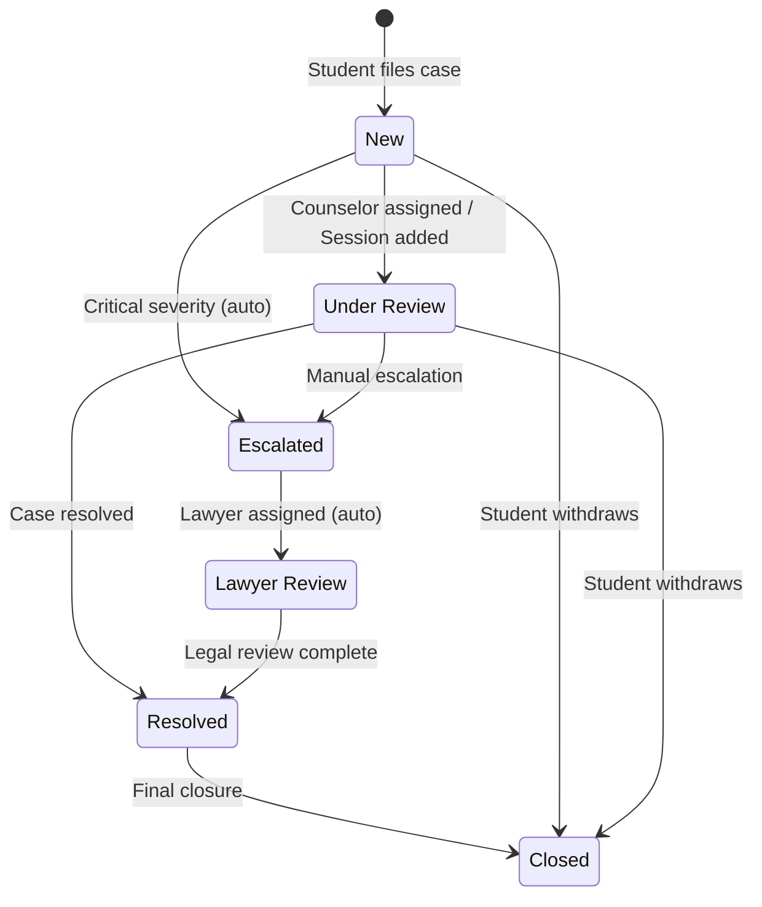
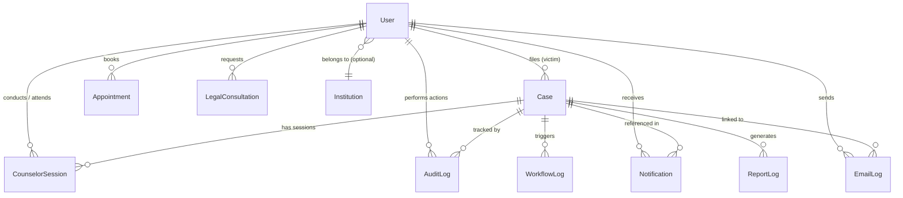

<p align="center">
  <h1 align="center">🛡️ RakshaNET</h1>
  <p align="center">
    <strong>AI-Powered Cyber Safety & Incident Management Platform</strong>
  </p>
</p>

---

## Overview

RakshaNET is a full-stack web application designed for educational institutions to manage cyber harassment, bullying, and online misconduct incidents. It provides a structured pipeline where students report incidents, counselors conduct therapy sessions, lawyers handle legal escalation, and administrators oversee all platform operations.

The platform integrates AI-powered text analysis (combining a multilingual keyword dictionary engine with the HuggingFace `unitary/toxic-bert` model) to automatically assess the severity of reported incidents. It includes an automated workflow engine that triggers state transitions based on severity and case events, PDF escalation report generation with Indian legal provision mapping, SHA-256 evidence integrity verification, LinkedIn misconduct email reporting, and a comprehensive audit trail.

### Core Problem

Educational institutions lack a unified digital system to receive, triage, escalate, and track cyber harassment reports. Students need a safe channel to report incidents (including anonymously), counselors need structured session management, lawyers need case escalation tools, and administrators need platform-wide visibility. RakshaNET fills this gap with role-based dashboards and automated workflows.

---

## Key Features

| Category | Feature | Status |
|---|---|---|
| **Incident Reporting** | Multi-input case filing with evidence upload (up to 10 files, 20MB each) | ✅ Implemented |
| **AI/NLP Analysis** | Hybrid severity detection — multilingual keyword dictionary (10 languages) + HuggingFace `toxic-bert` model | ✅ Implemented |
| **Case Management** | Full lifecycle: New → Under Review → Escalated → Lawyer Review → Resolved → Closed | ✅ Implemented |
| **Evidence Vault** | SHA-256 hashed evidence storage with integrity verification | ✅ Implemented |
| **Automated Workflows** | Rule-based state transitions (auto-escalation for Critical severity, auto-status on assignment/session) | ✅ Implemented |
| **Therapy & Counseling** | Appointment booking (In-Person / Video Call / Phone Call), counselor session notes with mood & risk tracking | ✅ Implemented |
| **Legal Consultation** | Lawyer matching, free/paid consultation requests (1 free per case limit), case-linked consultations | ✅ Implemented |
| **LinkedIn Misconduct Reporting** | Send formal HR complaint emails to companies (with 7-day duplicate prevention) | ✅ Implemented |
| **PDF Escalation Reports** | Auto-generated PDF reports with legal provisions (IPC/IT Act mapping) and cybercrime portal instructions | ✅ Implemented |
| **Email Notifications** | Gmail SMTP email delivery with retry mechanism for failed emails | ✅ Implemented |
| **In-App Notifications** | Notification bell with mark-as-read and mark-all-as-read | ✅ Implemented |
| **Admin Dashboard** | Platform-wide stats, user management, case oversight, session monitoring, audit logs | ✅ Implemented |
| **Analytics Dashboard** | Monthly case trends, severity distribution, status breakdown charts (Recharts) | ✅ Implemented |
| **Audit Logging** | Every significant action logged (case creation, assignment, status changes, sessions, notes) | ✅ Implemented |
| **System Logging** | Request-level logging to MongoDB (every API call logged with method, URL, status, IP) | ✅ Implemented |
| **Role-Based Access Control** | 5 roles: `student`, `counselor`, `hr`, `lawyer`, `admin` | ✅ Implemented |
| **Anonymous Reporting** | Students can file cases anonymously (alias generated as `ANON-xxxx`) | ✅ Implemented |
| **Case Withdrawal** | Students can withdraw their own cases | ✅ Implemented |
| **Seed Script** | Database seeder for demo data (users, cases, sessions, appointments, notifications, audit logs) | ✅ Implemented |
| **Academic Support Resources** | Static resource pages for academic continuity | ✅ Implemented |
| **Awareness Resources** | Cyber safety guides, privacy checklists, consent education | ✅ Implemented |

---

## Technology Stack

### Frontend

| Technology | Version | Purpose |
|---|---|---|
| React | 19.2.0 | UI component library |
| TypeScript | ~5.9.3 | Static type checking |
| Vite | 7.3.1 | Build tool & dev server |
| React Router DOM | 7.13.1 | Client-side routing |
| Redux Toolkit | 2.11.2 | State management (installed; localStorage used for auth state) |
| React Redux | 9.2.0 | Redux React bindings |
| Axios | 1.13.6 | HTTP client for API calls |
| Recharts | 3.8.0 | Data visualization charts |
| Tailwind CSS | 4.2.1 | Utility-first CSS framework |
| ESLint | 9.39.1 | Code linting |
| PostCSS | 8.5.6 | CSS transformation |

### Backend

| Technology | Version | Purpose |
|---|---|---|
| Node.js | — | JavaScript runtime |
| Express | 5.2.1 | Web framework |
| Mongoose | 9.2.3 | MongoDB ODM |
| jsonwebtoken | 9.0.3 | JWT authentication |
| bcryptjs | 3.0.3 | Password hashing (salt rounds: 10) |
| Multer | 2.1.0 | Multipart file uploads (disk storage) |
| Nodemailer | 8.0.1 | Gmail SMTP email delivery |
| PDFKit | 0.17.2 | PDF report generation |
| Helmet | 8.1.0 | Security HTTP headers |
| cors | 2.8.6 | Cross-origin resource sharing |
| Morgan | 1.10.1 | HTTP request logging (console) |
| express-validator | 7.3.1 | Input validation (installed, not wired into routes) |
| dotenv | 17.3.1 | Environment variable loading |
| Axios | 1.13.6 | HTTP client (for HuggingFace API calls) |
| Nodemon | 3.1.14 | Dev auto-restart (devDependency) |

#### Installed but Not Actively Used

| Technology | Version | Notes |
|---|---|---|
| tesseract.js | 7.0.0 | OCR library — installed but no routes or controllers use it |
| twilio | 5.12.2 | SMS — installed, `Institution.settings.twilioEnabled` flag exists, but no SMS sending logic |
| gridfs-stream | 1.1.1 | GridFS for large files — installed but not used; files stored on disk |
| crypto | 1.0.1 | SHA-256 hashing — the native Node.js `crypto` module is used directly |

### Database

| Technology | Purpose |
|---|---|
| MongoDB (Atlas) | Primary database (cloud-hosted) |
| Mongoose | Schema modeling, queries, and data validation |

### External Services

| Service | Purpose |
|---|---|
| HuggingFace Inference API (`unitary/toxic-bert`) | AI toxicity analysis |
| Gmail SMTP (via Nodemailer) | Email delivery for HR complaints and alerts |

---

## System Architecture



### Request Flow

```
Client (React)
  ↓ Axios + Bearer Token
Express Router
  ↓
Auth Middleware (JWT verify → req.user)
  ↓
Role Middleware (allowRoles check)
  ↓
Controller (business logic)
  ↓
Service Layer (NLP, Workflow, Audit, Email, Notification)
  ↓
Mongoose Models → MongoDB Atlas
```

---

## Project Structure

```
RakshaNET/
├── .gitignore
├── README.md
├── backend/
│   ├── .env                              # Environment configuration (not committed)
│   ├── package.json
│   ├── scripts/
│   │   └── seedData.js                   # Database seeder (demo users, cases, sessions)
│   ├── uploads/                           # Evidence file storage (disk)
│   └── src/
│       ├── app.js                         # Express app entry point & server startup
│       ├── config/
│       │   └── db.js                      # MongoDB connection via Mongoose
│       ├── controllers/                   # 13 controller files (request handlers)
│       │   ├── adminController.js         # Dashboard stats, user management, logs
│       │   ├── analyticsController.js     # Aggregation: monthly trends, severity, status
│       │   ├── auditController.js         # Audit log queries
│       │   ├── authController.js          # Register (bcrypt) & Login (JWT)
│       │   ├── caseController.js          # Case CRUD, NLP on create, evidence hashing
│       │   ├── complaintController.js     # PDF escalation report generation (PDFKit)
│       │   ├── counselorController.js     # Session CRUD with mood/risk tracking
│       │   ├── emailController.js         # LinkedIn HR complaints, alert emails, retry
│       │   ├── legalController.js         # Lawyer listing, consultation requests
│       │   ├── nlpController.js           # HuggingFace + keyword analysis endpoint
│       │   ├── notificationController.js  # In-app notification management
│       │   ├── resourceController.js      # Static resource data (academic, awareness)
│       │   └── therapyController.js       # Appointment booking & management
│       ├── middleware/
│       │   ├── authMiddleware.js           # JWT verification → req.user
│       │   ├── roleMiddleware.js           # allowRoles(...) access control
│       │   └── upload.js                   # Multer disk storage, 20MB limit
│       ├── models/                        # 15 Mongoose schema definitions
│       │   ├── Appointment.js
│       │   ├── AuditLog.js
│       │   ├── Case.js
│       │   ├── CounselorSession.js
│       │   ├── EmailLog.js
│       │   ├── EscalationReport.js
│       │   ├── Institution.js
│       │   ├── LegalConsultation.js
│       │   ├── NLPLog.js
│       │   ├── Notification.js
│       │   ├── ReportLog.js
│       │   ├── SessionLog.js
│       │   ├── SystemLog.js
│       │   ├── User.js
│       │   └── WorkflowLog.js
│       ├── routes/                        # 13 Express router files
│       │   ├── adminRoutes.js
│       │   ├── analyticsRoutes.js
│       │   ├── auditRoutes.js
│       │   ├── authRoutes.js
│       │   ├── caseRoutes.js
│       │   ├── complaintRoutes.js
│       │   ├── counselorRoutes.js
│       │   ├── emailRoutes.js
│       │   ├── legalRoutes.js
│       │   ├── nlpRoutes.js
│       │   ├── notificationRoutes.js
│       │   ├── resourceRoutes.js
│       │   └── therapyRoutes.js
│       ├── services/                      # 8 service modules (business logic)
│       │   ├── auditService.js            # AuditLog.create wrapper
│       │   ├── emailService.js            # Nodemailer SMTP transporter
│       │   ├── nlpEngine.js               # Multilingual keyword dictionary (10 languages)
│       │   ├── nlpService.js              # Combined NLP: rule-based + AI scoring
│       │   ├── notificationService.js     # Notification.create wrapper
│       │   ├── toxicityModel.js           # HuggingFace toxic-bert API caller
│       │   ├── workflowEngine.js          # State machine for case transitions
│       │   └── workflowService.js         # Severity-based automation triggers
│       └── utils/
│           ├── generateTokens.js          # JWT access & refresh token generation
│           └── logger.js                  # System request/error logging to MongoDB
└── frontend/
    ├── .gitignore
    ├── index.html                         # Vite HTML entry point
    ├── package.json
    ├── vite.config.ts
    ├── tailwind.config.ts
    ├── tsconfig.json / tsconfig.app.json / tsconfig.node.json
    ├── eslint.config.js
    ├── public/
    │   └── vite.svg
    ├── scripts/
    │   ├── removeNavbars.js               # Utility script
    │   └── removeNavbars.cjs
    └── src/
        ├── main.tsx                       # React entry point (StrictMode)
        ├── App.tsx                        # BrowserRouter & all route definitions
        ├── App.css
        ├── index.css                      # Tailwind CSS imports
        ├── assets/
        │   ├── bg.jpeg
        │   └── react.svg
        ├── components/
        │   ├── Layout.tsx                 # Shared layout (Navbar + Outlet)
        │   ├── Navbar.tsx                 # Role-aware navigation bar
        │   ├── NotificationBell.tsx       # Notification dropdown with unread count
        │   └── ProtectedRoute.tsx         # Auth + role guard component
        ├── pages/
        │   ├── Home.tsx                   # Public landing page
        │   ├── Login.tsx                  # Login form
        │   ├── Register.tsx               # Registration form
        │   ├── Dashboard.tsx              # Student dashboard
        │   ├── pillars/                   # Student feature pages (9 files)
        │   ├── counselor/                 # Counselor pages (4 files)
        │   ├── lawyer/                    # Lawyer pages (3 files)
        │   └── admin/                     # Admin pages (6 files + 1 utility)
        └── services/
            └── api.ts                     # Axios instance with Bearer token interceptor
```

---

## Application Workflow

### Case Lifecycle



### Case Creation Flow

1. Student submits a case via `POST /api/v1/cases` (multipart form with `evidenceFiles`)
2. `caseController.createCase` runs NLP analysis on the description/inputs via `nlpEngine.analyzeText`
3. Evidence files are SHA-256 hashed and stored to `uploads/` directory
4. A `ReportLog` is created with detected keywords and severity
5. `workflowService.triggerWorkflow` evaluates severity — Critical cases get system notes enabling HR escalation; High cases get legal action suggestions; repeated reporters (>3 cases) trigger admin alerts
6. `workflowEngine.checkStateTransitions` evaluates state rules — Critical severity auto-escalates the case status to "Escalated"
7. Audit log and notification are created
8. The case is returned to the frontend

### NLP Analysis Pipeline

The platform uses two analysis systems that work in parallel:

1. **Multilingual Keyword Dictionary** (`nlpEngine.js`): Scans text against threat and abuse word lists in 10 languages (English, Hindi, Telugu, Tamil, Kannada, Malayalam, Bengali, Marathi, Punjabi, Gujarati). Threat matches score +40 each, abuse matches score +15 each, capped at 100.

2. **HuggingFace toxic-bert Model** (`toxicityModel.js`): Calls the `unitary/toxic-bert` inference API for ML-based toxicity scoring.

3. **Score Fusion** (`nlpService.js`): Combines the rule-based score with the AI score (weighted at 50%): `finalScore = ruleScore + aiScore × 0.5`, capped at 100.

4. **Severity Labels**: Low (0-19), Medium (20-39), High (40-69), Critical (70-100).

> **Note:** The standalone `/api/v1/nlp/analyze` endpoint in `nlpController.js` uses a slightly different scoring formula (takes the max of AI and dictionary scores) and different thresholds than the internal `nlpService.js` used during case creation. This is an implementation inconsistency.

---

## Features — Detailed Explanation

### Incident Reporting

Students file cases through a multi-step form that collects incident date, time, platform, description, multiple text inputs, offender information, and evidence files. The `anonymous` flag generates a random alias (`ANON-xxxx`) to protect the reporter's identity. Up to 10 evidence files (20MB each) can be attached; each is SHA-256 hashed at upload for integrity verification.

### Evidence Vault

The Evidence Vault page displays all evidence files across a student's cases. The `GET /api/v1/cases/evidence` endpoint flattens evidence from all matching cases. Evidence integrity can be verified via `GET /api/v1/cases/:id/evidence/:fileName/verify`, which re-hashes the stored file and compares it against the original hash.

### Therapy & Counseling

Students book appointments with counselors (In-Person, Video Call, or Phone Call). Counselors create session notes linked to specific cases, tracking mood (Stable/Anxious/Distressed/Critical), risk level (Low/Medium/High/Critical), and recommendations. The workflow engine automatically transitions case status to "Under Review" when a session is added.

### Legal Consultation

Students request consultations with lawyers, linked to specific case numbers. Free consultations are limited to one per case per student — the system enforces this constraint. Consultations support document uploads and multiple modes (Video Call, Phone Call, In-Person).

### LinkedIn Misconduct Reporting

Students can send formal HR complaint emails to companies about employee misconduct on LinkedIn. The system includes 7-day duplicate prevention (same sender + company + offender profile = blocked within 7 days). Email logs track send status, retry count, and errors.

### PDF Escalation Reports

The complaint controller generates structured PDF escalation reports using PDFKit, including:
- Executive summary with case categorization
- Incident details with location and description
- Accused/offender information
- Evidence annexure with SHA-256 hashes
- Legal provision mapping (IPC 384, IT Act 66C/66D, IPC 354D, IPC 509)
- Declaration section
- Step-by-step escalation instructions for India's National Cyber Crime Reporting Portal (cybercrime.gov.in)

### Admin Dashboard & Analytics

The admin dashboard aggregates platform-wide statistics (total users, cases, critical cases, sessions, appointments) and recent audit logs. The analytics dashboard uses Recharts to visualize:
- Monthly case creation trends (bar chart)
- Severity distribution (pie chart)
- Status breakdown (pie chart)

---

## API Documentation

Base URL: `http://localhost:5000/api/v1`

### Authentication

| Method | Endpoint | Auth | Description |
|---|---|---|---|
| `POST` | `/auth/register` | ❌ | Register new user |
| `POST` | `/auth/login` | ❌ | Login and receive JWT tokens |

**Register Request:**
```json
{
  "name": "string",
  "email": "string",
  "password": "string",
  "role": "student | counselor | hr | lawyer | admin"
}
```

**Login Request:**
```json
{
  "email": "string",
  "password": "string"
}
```

**Auth Response:**
```json
{
  "accessToken": "jwt-string",
  "refreshToken": "jwt-string",
  "user": { "name": "...", "email": "...", "role": "..." }
}
```

---

### Cases

| Method | Endpoint | Auth | Roles | Description |
|---|---|---|---|---|
| `POST` | `/cases` | ✅ | `student` | Create case (multipart: `evidenceFiles` field, max 10) |
| `GET` | `/cases` | ✅ | All | Get cases (role-filtered, supports `?status`, `?severity`, `?search`) |
| `GET` | `/cases/stats` | ✅ | All | Case counts by status |
| `GET` | `/cases/evidence` | ✅ | All | Flattened evidence list across cases |
| `GET` | `/cases/:id` | ✅ | All | Single case with sessions (access-controlled per role) |
| `PUT` | `/cases/:id/status` | ✅ | All | Update case status |
| `PUT` | `/cases/:id/assign` | ✅ | `admin`, `lawyer` | Assign case to a user |
| `PUT` | `/cases/:id/withdraw` | ✅ | `student` | Withdraw (close) case |
| `POST` | `/cases/:id/note` | ✅ | All | Add note to case |
| `GET` | `/cases/:id/corporate-draft` | ✅ | All | Generate corporate misconduct email draft |
| `GET` | `/cases/:id/evidence/:fileName/verify` | ✅ | All | Verify evidence SHA-256 integrity |

---

### Complaints (Escalation Reports)

| Method | Endpoint | Auth | Description |
|---|---|---|---|
| `POST` | `/complaints/college` | ❌ | Generate PDF escalation report (multipart: `evidenceFiles`) |

---

### Email

| Method | Endpoint | Auth | Description |
|---|---|---|---|
| `POST` | `/email/linkedin-complaint` | ✅ | Send LinkedIn misconduct complaint to HR |
| `GET` | `/email/logs` | ✅ | Get current user's email logs |
| `POST` | `/email/alert` | ✅ | Send generic alert email |
| `POST` | `/email/retry/:logId` | ✅ | Retry a failed email |

---

### Therapy & Appointments

| Method | Endpoint | Auth | Roles | Description |
|---|---|---|---|---|
| `GET` | `/therapy/counselors` | ✅ | All | List all counselors |
| `POST` | `/therapy/book` | ✅ | `student` | Book appointment |
| `GET` | `/therapy/my` | ✅ | `student` | Get my appointments |
| `GET` | `/therapy/assigned` | ✅ | `counselor`, `lawyer` | Get assigned appointments |
| `PUT` | `/therapy/appointments/:id/cancel` | ✅ | All | Cancel appointment |

---

### Legal Consultation

| Method | Endpoint | Auth | Roles | Description |
|---|---|---|---|---|
| `GET` | `/legal/lawyers` | ✅ | All | List all lawyers |
| `POST` | `/legal/request` | ✅ | `student` | Request consultation |
| `GET` | `/legal/my` | ✅ | `student` | Get my consultations |
| `GET` | `/legal/assigned` | ✅ | `lawyer` | Get assigned consultations |

---

### NLP Analysis

| Method | Endpoint | Auth | Description |
|---|---|---|---|
| `POST` | `/nlp/analyze` | ❌ | Analyze text for toxicity (AI + keywords) |

**Request:**
```json
{ "texts": ["text to analyze"] }
```

**Response:**
```json
{
  "results": [{
    "text": "...",
    "severity": "Low|Medium|High|Critical",
    "severityScore": 0-100,
    "aiScore": 0-100,
    "language": "English|Hindi|Telugu|Tamil",
    "threatWords": ["..."],
    "abusiveWords": ["..."],
    "riskLevel": "Safe|Suspicious|Warning|Danger",
    "evidenceScore": 0-100,
    "caseSuggestion": "No action|Monitor|Save Evidence|File Police Complaint"
  }]
}
```

> **Note:** This endpoint is **unauthenticated** — no auth middleware is applied on the NLP route.

---

### Counselor Sessions

| Method | Endpoint | Auth | Roles | Description |
|---|---|---|---|---|
| `POST` | `/counselor/session` | ✅ | `counselor` | Create session notes |
| `GET` | `/counselor/session/:caseId` | ✅ | All | Get sessions for a case |
| `GET` | `/counselor/session/student/my` | ✅ | `student` | Get my sessions |

---

### Resources

| Method | Endpoint | Auth | Description |
|---|---|---|---|
| `GET` | `/resources/academic` | ✅ | Get academic support resources (static data) |
| `GET` | `/resources/awareness` | ✅ | Get cyber awareness resources (static data) |

---

### Notifications

| Method | Endpoint | Auth | Description |
|---|---|---|---|
| `GET` | `/notifications` | ✅ | Get user's notifications (limit 100) |
| `PUT` | `/notifications/read` | ✅ | Mark single notification as read (body: `{id}`) |
| `PUT` | `/notifications/read-all` | ✅ | Mark all notifications as read |

---

### Audit Logs

| Method | Endpoint | Auth | Roles | Description |
|---|---|---|---|---|
| `GET` | `/audit` | ✅ | `admin` | Get all audit logs (limit 500) |
| `GET` | `/audit/case/:id` | ✅ | `admin` | Get audit logs for a specific case |

---

### Admin

| Method | Endpoint | Auth | Roles | Description |
|---|---|---|---|---|
| `GET` | `/admin/dashboard-stats` | ✅ | `admin` | Dashboard statistics |
| `GET` | `/admin/users` | ✅ | `admin` | List all users |
| `GET` | `/admin/users/:id` | ✅ | `admin` | Get user details with case/session/appointment counts |
| `PUT` | `/admin/user-status` | ✅ | `admin` | Update user verification status |
| `GET` | `/admin/sessions` | ✅ | `admin` | Get all counselor sessions |
| `GET` | `/admin/logs` | ✅ | `admin` | Get all audit logs |

---

### Analytics

| Method | Endpoint | Auth | Roles | Description |
|---|---|---|---|---|
| `GET` | `/analytics/overview` | ✅ | `admin` | Full analytics (monthly trends, severity, status) |

---

## Database Design

MongoDB with **15 collections** defined via Mongoose schemas.

### Entity-Relationship Diagram



### Collections & Key Fields

| Collection | Key Fields | References | Indexes |
|---|---|---|---|
| **User** | `email`, `passwordHash`, `name`, `role` (student/counselor/hr/lawyer/admin), `profile` {phone, department, year, employeeId}, `isActive`, `lastLogin`, `refreshToken` | `institutionId` → Institution | Compound unique: `{email, institutionId}` |
| **Institution** | `name`, `domain`, `contactEmail`, `contactPhone`, `subscriptionPlan` (free/premium), `settings` {allowAnonymousReporting, twilioEnabled, autoWarning} | — | Unique: `domain` |
| **Case** | `caseNumber` (unique), `victim` {user, alias, anonymous, department}, `description`, `multipleInputs[]`, `severity` (Critical/High/Medium/Low), `severityColor`, `status` (New/Under Review/Escalated/Lawyer Review/Resolved/Closed), `aiAnalysis` {detectedCategories, confidence, summary, keywords}, `assignedTo` {user, role}, `evidence[]` {fileName, storedName, hash, size}, `timeline[]`, `notes[]`, `logs[]` | `victim.user` → User, `assignedTo.user` → User | Unique: `caseNumber` |
| **Appointment** | `student`, `counselorName`, `counselorId`, `date`, `time`, `sessionType` (In-Person/Video Call/Phone Call), `reason`, `status` (upcoming/completed/cancelled) | `student` → User, `counselorId` → User | — |
| **CounselorSession** | `caseId`, `counselor`, `student`, `notes`, `mood` (Stable/Anxious/Distressed/Critical), `riskLevel` (Low/Medium/High/Critical), `recommendation`, `nextSessionDate` | `caseId` → Case, `counselor` → User, `student` → User | — |
| **LegalConsultation** | `student`, `lawyerName`, `lawyerId`, `caseNumber`, `consultationType` (Free/Paid), `preferredDate`, `preferredTime`, `mode` (Video Call/Phone Call/In-Person), `description`, `documents[]`, `status` (Pending/Confirmed/Completed/Cancelled) | `student` → User, `lawyerId` → User | — |
| **EscalationReport** | `caseNumber`, `category`, `incidentDate`, `incidentTime`, `location`, `description`, `complainant` {name, email, phone}, `offender` {name, username, platform, profileUrl}, `evidence[]`, `pdfFileName`, `status` (generated/submitted/closed) | — | — |
| **EmailLog** | `sender`, `companyName`, `hrEmail`, `recipient`, `caseId`, `subject`, `content`, `offenderName`, `offenderProfile`, `evidenceText`, `status` (Sent/Failed/Pending), `retryCount`, `error` | `sender` → User, `caseId` → Case | — |
| **AuditLog** | `user`, `role`, `action`, `caseId`, `targetUser`, `details`, `timestamp` | `user` → User, `caseId` → Case, `targetUser` → User | — |
| **Notification** | `userId`, `message`, `type` (Alert/Info/Success/Warning), `caseId`, `read`, `createdAt` | `userId` → User, `caseId` → Case | — |
| **NLPLog** | `text`, `language`, `abusiveWords[]`, `threatWords[]`, `severityScore`, `userId`, `sessionId` | `userId` → User | — |
| **SessionLog** | `sessionId`, `userId`, `inputs[]`, `results[]` {text, severity, abusiveWords, threatWords, language}, `totalSeverity` | `userId` → User | Unique: `sessionId` |
| **ReportLog** | `user`, `time`, `detectedKeywords[]`, `severityScore`, `status`, `caseId` | `user` → User, `caseId` → Case | — |
| **SystemLog** | `level` (info/warn/error), `type` (REQUEST/ERROR/ACTION), `message`, `meta` (Mixed), `user`, `timestamp` | `user` → User | — |
| **WorkflowLog** | `caseId`, `triggerCondition`, `actionTaken`, `status`, `timestamp` | `caseId` → Case | — |

---

## Authentication & Authorization

### Authentication Flow

1. User registers via `POST /api/v1/auth/register` — password is hashed with `bcryptjs` (10 salt rounds), stored as `passwordHash`
2. Server returns `accessToken` (7-day expiry, signed with `JWT_SECRET`) and `refreshToken` (7-day expiry, signed with `JWT_REFRESH_SECRET`)
3. Frontend stores `accessToken`, `refreshToken`, and `role` in `localStorage`
4. Every API request includes `Authorization: Bearer <accessToken>` via Axios request interceptor (`src/services/api.ts`)
5. Backend `authMiddleware.js` extracts and verifies the JWT, sets `req.user = { id, role }` on the request
6. `roleMiddleware.js` exports `allowRoles(...roles)` — a higher-order middleware that checks `req.user.role` against allowed roles, returning 403 if unauthorized

### JWT Token Payload

**Access Token:** `{ id: user._id, role: user.role }` (7-day expiry)

**Refresh Token:** `{ id: user._id }` (7-day expiry)

> **Note:** The backend generates refresh tokens and stores them on the User document, but there is **no `/refresh` endpoint** to exchange a refresh token for a new access token. The refresh token is currently generated but not consumed.

### Frontend Route Guards

The `ProtectedRoute` component:
1. Checks if `accessToken` exists in `localStorage` — redirects to `/login` if missing
2. Checks if the user's `role` matches `allowedRoles` for the route
3. On role mismatch, redirects to the appropriate role-based dashboard (`/admin`, `/lawyer`, `/counselor`, or `/dashboard`)

### Role Permissions Summary

| Feature | student | counselor | lawyer | admin |
|---|---|---|---|---|
| File cases | ✅ | ❌ | ❌ | ❌ |
| View own cases | ✅ | — | — | — |
| View assigned/relevant cases | — | ✅ | ✅ | ✅ (all) |
| Assign cases | ❌ | ❌ | ✅ | ✅ |
| Create counselor sessions | ❌ | ✅ | ❌ | ❌ |
| Book appointments | ✅ | ❌ | ❌ | ❌ |
| Request legal consultation | ✅ | ❌ | ❌ | ❌ |
| View audit logs | ❌ | ❌ | ❌ | ✅ |
| View analytics | ❌ | ❌ | ❌ | ✅ |
| Manage users | ❌ | ❌ | ❌ | ✅ |
| Withdraw cases | ✅ | ❌ | ❌ | ✅ |

---

## Configuration

### Required Environment Variables

Create a `backend/.env` file:

```env
# Database (MongoDB Atlas connection string)
MONGO_URI=mongodb+srv://<username>:<password>@<cluster>.mongodb.net/<dbname>?retryWrites=true&w=majority

# Server Port
PORT=5000

# JWT Secrets
JWT_SECRET=<your-jwt-secret-key>
JWT_REFRESH_SECRET=<your-jwt-refresh-secret-key>

# Email (Gmail SMTP)
EMAIL_USER=<your-email@gmail.com>
EMAIL_PASS=<your-gmail-app-password>

# HuggingFace AI (used in nlpController.js)
HF_TOKEN=<your-huggingface-api-token>
```

> **Important:** The `toxicityModel.js` service reads the HuggingFace token as `process.env.HF_KEY`, while `nlpController.js` reads it as `process.env.HF_TOKEN`. Both environment variables may need to be set for full functionality, or the code should be unified.

> **Gmail App Password:** `EMAIL_PASS` must be a Gmail App Password (not your regular password). Generate one at [Google App Passwords](https://myaccount.google.com/apppasswords) with 2FA enabled.

> **HuggingFace Token:** Get a free API token at [huggingface.co/settings/tokens](https://huggingface.co/settings/tokens).

---

## Installation

### Prerequisites

- **Node.js** v18+ recommended
- **npm** (included with Node.js)
- **MongoDB** — Atlas cloud instance (recommended) or local MongoDB
- **Git**

### Setup Steps

```bash
# 1. Clone the repository
git clone https://github.com/YashwanthChowdaryV/rakshanet.git
cd RakshaNET

# 2. Install backend dependencies
cd backend
npm install

# 3. Install frontend dependencies
cd ../frontend
npm install

# 4. Configure environment variables
# Create backend/.env with the variables listed in Configuration section

# 5. (Optional) Seed the database with demo data
cd ../backend
npm run seed
```

### Seed Data

The seed script (`backend/scripts/seedData.js`) populates the database with:
- 10 students, 3 lawyers, 2 counselors, 1 admin
- 2 sample cases (one Critical, one Under Review)
- 1 counselor session
- 2 appointments
- 4 notifications
- 3 audit logs

**Default seeded credentials:**

| Role | Email | Password |
|---|---|---|
| Student | `student1@test.com` | `password123` |
| Counselor | `counselor1@test.com` | `password123` |
| Lawyer | `lawyer1@test.com` | `password123` |
| Admin | `admin@test.com` | `password123` |

> **Note:** The seed script stores the hashed password in a field called `password` rather than `passwordHash` (the field the User schema expects). This may cause seeded users to fail login if the schema validation is strict. Verify and adjust if needed.

---

## Running the Application

### Development

```bash
# Terminal 1 — Backend
cd backend
npm run dev
# Starts with Nodemon on http://localhost:5000

# Terminal 2 — Frontend
cd frontend
npm run dev
# Starts Vite dev server on http://localhost:5173
```

### Production

```bash
# Backend
cd backend
npm start
# Runs: node src/app.js

# Frontend
cd frontend
npm run build
# Runs: tsc -b && vite build
# Outputs to frontend/dist/
# Serve dist/ with any static file server (nginx, serve, etc.)
```

---

## Available Scripts

### Backend (`backend/package.json`)

| Script | Command | Description |
|---|---|---|
| `dev` | `nodemon src/app.js` | Start with auto-restart |
| `start` | `node src/app.js` | Start in production mode |
| `seed` | `node scripts/seedData.js` | Seed database with demo data |
| `test` | `echo "Error: no test specified"` | Placeholder — no tests configured |

### Frontend (`frontend/package.json`)

| Script | Command | Description |
|---|---|---|
| `dev` | `vite` | Start Vite dev server |
| `build` | `tsc -b && vite build` | TypeScript compile + production build |
| `lint` | `eslint .` | Run ESLint |
| `preview` | `vite preview` | Preview production build locally |

---

## Frontend Routes

| Route | Component | Role Guard | Description |
|---|---|---|---|
| `/` | `Home` | Public | Landing page |
| `/login` | `Login` | Public | Login form |
| `/register` | `Register` | Public | Registration form |
| `/dashboard` | `Dashboard` | `student` | Student dashboard with stats and quick actions |
| `/report` | `ReportIncident` | `student` | Case filing form with evidence upload |
| `/cases` | `CaseManagement` | `student` | Case list with search, filters, detail view |
| `/evidence` | `EvidenceVault` | `student` | Evidence files with SHA-256 verification |
| `/legal` | `LegalConsultation` | `student` | Legal consultation request |
| `/therapy` | `TherapySupport` | `student` | Appointment booking with counselors |
| `/academic` | `AcademicSupport` | `student` | Academic continuity resources |
| `/resources` | `AwarenessResources` | `student` | Cyber safety awareness content |
| `/linkedin-report` | `LinkedInMisconductReport` | `student` | LinkedIn HR complaint tool |
| `/nlp` | `NLPAnalysis` | None (inside Layout) | AI-powered text analysis tool |
| `/counselor` | `CounselorDashboard` | `counselor` | Counselor overview |
| `/counselor/cases` | `CounselorCases` | `counselor` | Assigned cases |
| `/counselor/case/:id` | `CounselorCaseDetails` | `counselor` | Case detail + session management |
| `/lawyer` | `LawyerDashboard` | `lawyer` | Lawyer overview |
| `/lawyer/cases` | `LawyerCases` | `lawyer` | Escalated cases |
| `/lawyer/case/:id` | `LawyerCaseDetails` | `lawyer` | Case detail + legal actions |
| `/admin` | `AdminDashboard` | `admin` | Platform stats + recent logs |
| `/admin/users` | `AdminUsers` | `admin` | User management |
| `/admin/cases` | `AdminCases` | `admin` | All cases overview |
| `/admin/case/:id` | `AdminCaseDetails` | `admin` | Full case detail |
| `/admin/logs` | `AdminLogs` | `admin` | Audit log viewer |
| `/admin/analytics` | `AnalyticsDashboard` | `admin` | Charts and analytics |

> **Note:** The `CounselorSessions.tsx` file exists in `frontend/src/pages/counselor/` but has no corresponding route in `App.tsx`. It may be used as an embedded component or is an unreferenced page.

---

## Error Handling

### Backend

- **Global Error Handler**: Express error middleware in `app.js` catches unhandled errors, logs the stack trace, and returns `{ success: false, message: "Internal Server Error" }` with status 500
- **Error Logger**: The `errorLogger` middleware writes errors to the `SystemLog` MongoDB collection (level: "error", type: "ERROR") before passing to the global handler
- **Controller-Level**: Each controller wraps operations in try-catch blocks, returning appropriate HTTP status codes (400, 401, 403, 404, 500) with descriptive messages
- **Auth Errors**: Missing token returns 401 "No token provided"; invalid/expired token returns 401 "Invalid token"
- **Role Errors**: Insufficient permissions return 403 "Access forbidden: insufficient permissions"
- **Email Failures**: Failed emails are logged with status "Failed" and error message; the retry endpoint allows re-sending

### Frontend

- **Route Guards**: `ProtectedRoute` redirects unauthenticated users to `/login` and role-mismatched users to their appropriate dashboard
- **API Interceptor**: Axios instance automatically attaches auth tokens; individual pages handle API errors with try-catch

---

## Security Considerations

### Implemented

- **Password Hashing**: bcryptjs with 10 salt rounds — raw passwords are never stored
- **JWT Authentication**: Stateless token-based auth with separate access and refresh secrets
- **Helmet**: Security HTTP headers (X-Content-Type-Options, X-Frame-Options, etc.)
- **CORS**: Restricted to `http://localhost:5173` (hardcoded)
- **Evidence Integrity**: SHA-256 hashing of uploaded evidence files
- **Role-Based Access Control**: Middleware-enforced role restrictions on API routes
- **Duplicate Prevention**: 7-day window for LinkedIn complaint emails
- **File Size Limits**: 20MB per file via Multer configuration
- **Audit Trail**: Every significant action is logged to AuditLog collection

### Security Gaps

- **No Rate Limiting**: API endpoints have no rate limiting (susceptible to brute force)
- **No Input Validation Middleware**: `express-validator` is installed but not wired into any route — request bodies are not validated at the middleware level
- **Hardcoded CORS Origin**: CORS is set to `http://localhost:5173` rather than an environment variable
- **NLP Endpoint Unauthenticated**: `POST /api/v1/nlp/analyze` has no auth middleware — anyone can call it
- **Complaints Endpoint Unauthenticated**: `POST /api/v1/complaints/college` has no auth middleware
- **Credentials in `.env`**: The `.env` file is committed to the repository (should be in `.gitignore` — it is listed there but may have been committed before the rule was added)
- **No Refresh Token Rotation**: Refresh tokens are generated but no endpoint exists to exchange them
- **No Password Reset Flow**: No forgot-password or reset-password endpoint

---

## Design Decisions & Technical Highlights

### Workflow Engine Architecture

The system uses a **dual-engine workflow** approach:

1. **`workflowService.js` (Severity Triggers)**: Fires on case creation. Critical → enables HR escalation + legal suggestion. High → suggests legal action. Detects repeated reporters (>3 cases from same user).

2. **`workflowEngine.js` (State Machine)**: Fires on case events (severity assessed, counselor/lawyer assigned, session added). Implements deterministic state transitions with timeline entries, workflow logs, audit logs, and notifications.

### NLP Dual-Analysis System

Rather than relying solely on ML models (which may have latency, cold starts, or rate limits), the platform combines a **fast local keyword dictionary** with a **remote AI model**. The keyword dictionary provides immediate coverage for 10 Indian languages without API dependencies, while the toxic-bert model adds ML-based nuance.

### Evidence Chain of Custody

Evidence files are SHA-256 hashed at upload time and the hash is stored alongside the file metadata. The verification endpoint re-reads the file from disk and recomputes the hash — if it matches the stored hash, the file's integrity is confirmed (not tampered with post-upload).

### Service Layer Pattern

Business logic is separated into dedicated services (`auditService`, `notificationService`, `emailService`, `nlpEngine`, `nlpService`, `toxicityModel`, `workflowEngine`, `workflowService`) that are consumed by controllers. This allows the workflow engine and case controller to both trigger audit logs and notifications through the same service interfaces.

---

## Testing

**No test suite exists.** The backend `package.json` test script is a placeholder:

```json
"test": "echo \"Error: no test specified\" && exit 1"
```

The frontend has no test configuration (no Vitest, Jest, or Testing Library setup).

---

## Deployment

No Docker, CI/CD, or cloud deployment configuration files exist in the repository.

### Manual Deployment

**Backend:**
```bash
cd backend
npm start
```

**Frontend:**
```bash
cd frontend
npm run build
# Serve the dist/ directory with nginx, Apache, or a static file server
```

### Production Considerations

- Update CORS origin in `backend/src/app.js` (line 46) from `http://localhost:5173` to your production frontend domain
- Update `baseURL` in `frontend/src/services/api.ts` (line 4) from `http://localhost:5000/api/v1` to your production backend URL
- The PDF report download URL in `complaintController.js` is hardcoded to `http://localhost:5000/uploads/` — update for production
- Ensure the `uploads/` directory exists and has write permissions on the server
- Set secure, random values for `JWT_SECRET` and `JWT_REFRESH_SECRET`

---

## Limitations & Known Issues

1. **No Refresh Token Endpoint**: Refresh tokens are generated and stored but there's no `/auth/refresh` endpoint to exchange them — access tokens simply expire after 7 days
2. **Inconsistent HuggingFace Env Var**: `toxicityModel.js` reads `HF_KEY` while `nlpController.js` reads `HF_TOKEN`
3. **Seed Script Field Mismatch**: The seeder stores the password hash in a `password` field instead of `passwordHash` (the actual User schema field)
4. **No Pagination**: All API list endpoints return full result sets without pagination (except audit logs capped at 500 and notifications at 100)
5. **Hardcoded URLs**: CORS origin, API base URL, and PDF download URL are hardcoded to localhost
6. **No Input Validation**: `express-validator` is installed but not used in any route middleware chain
7. **Installed but Unused Dependencies**: `tesseract.js`, `twilio`, `gridfs-stream` are installed but have no active usage in routes or controllers
8. **Institution Model Underutilized**: The `Institution` schema exists and `User` has an `institutionId` field, but registration does not require or create institutions — multi-tenancy is not implemented
9. **NLP Scoring Inconsistency**: The standalone NLP endpoint (`nlpController.js`) uses `Math.max(aiScore, dictScore)` while case creation uses the `nlpService.js` weighted formula `ruleScore + aiScore * 0.5`
10. **CounselorSessions Page Not Routed**: `CounselorSessions.tsx` exists but has no route in `App.tsx`

---

## Future Improvements

> *These are potential improvements based on current limitations. They are NOT existing features.*

- [ ] **Refresh Token Rotation** — Implement `POST /auth/refresh` to issue new access tokens
- [ ] **WebSocket/SSE Notifications** — Replace polling for real-time notification updates
- [ ] **OCR Evidence Analysis** — Wire `tesseract.js` into evidence processing for screenshot-to-text extraction
- [ ] **SMS Alerts via Twilio** — Implement SMS notification sending using the already-installed `twilio` package
- [ ] **Docker Containerization** — Add Dockerfile and docker-compose.yml
- [ ] **Rate Limiting** — Add `express-rate-limit` to prevent API abuse
- [ ] **Input Validation** — Wire `express-validator` into route middleware chains
- [ ] **Test Suite** — Add Jest + Supertest for backend and Vitest for frontend
- [ ] **GridFS Migration** — Move file storage from disk to MongoDB GridFS for scalability
- [ ] **Pagination** — Add cursor-based or offset pagination to list endpoints
- [ ] **Password Reset Flow** — Implement forgot-password and reset-password endpoints
- [ ] **Environment-Based Configuration** — Replace hardcoded URLs with environment variables
- [ ] **Multi-Tenancy** — Fully utilize the Institution model for per-institution user isolation

---

## Troubleshooting

### MongoDB Connection Fails

- Verify `MONGO_URI` is correctly formatted in `backend/.env`
- Ensure your IP address is whitelisted in MongoDB Atlas Network Access
- If using local MongoDB, ensure `mongod` is running

### CORS Errors in Browser

- The backend allows requests only from `http://localhost:5173` (hardcoded in `app.js`)
- If your frontend runs on a different port, update line 46 in `backend/src/app.js`

### Email Sending Fails

- `EMAIL_PASS` must be a **Gmail App Password** (not your regular password)
- Enable 2FA on your Google account, then generate an App Password at [myaccount.google.com/apppasswords](https://myaccount.google.com/apppasswords)

### HuggingFace API Errors

- Verify your `HF_TOKEN` is valid
- The `toxic-bert` model may need cold-start time — retry after 30 seconds
- Free-tier API has rate limits
- Ensure both `HF_TOKEN` and `HF_KEY` are set in `.env` (see Configuration note about inconsistent env var names)

### JWT "Invalid Token" Errors

- Ensure `accessToken` is stored in `localStorage` (the frontend reads from there)
- Verify the `Authorization` header format is `Bearer <token>` (with a space)
- Tokens expire after 7 days — re-login to get fresh tokens

### File Uploads Fail

- Ensure `backend/uploads/` directory exists (Multer writes to it)
- Maximum file size is 20MB per file, up to 10 files per request
- Check disk space availability

### Seed Script Errors

- Run from the `backend/` directory: `npm run seed`
- Ensure MongoDB is accessible via `MONGO_URI`
- The script is idempotent — it skips collections that already have data

---

## Development Guidelines

### Code Organization

- **Backend**: Controllers handle HTTP request/response; Services contain business logic; Models define data schemas; Middleware handles cross-cutting concerns (auth, roles, uploads)
- **Frontend**: Pages in role-based directories (`pillars/` for students, `counselor/`, `lawyer/`, `admin/`); shared components in `components/`; centralized API client in `services/api.ts`

### Adding a New API Endpoint

1. Define the Mongoose model in `backend/src/models/`
2. Create the controller function in `backend/src/controllers/`
3. Create or update the route file in `backend/src/routes/`
4. Register the route in `backend/src/app.js`
5. Add appropriate auth/role middleware

### Adding a New Frontend Page

1. Create the component in the appropriate `pages/` subdirectory
2. Add the route in `frontend/src/App.tsx`
3. Wrap with `ProtectedRoute` if authentication/role restriction is needed
4. Add navigation link in `Navbar.tsx` if needed

### Git Conventions

Files excluded by `.gitignore`: `node_modules/`, `.env`, `uploads/`, `dist/`, `build/`, `*.log`

---

## Contributing

1. **Fork** the repository
2. **Clone** your fork: `git clone https://github.com/<your-username>/rakshanet.git`
3. **Create** a feature branch: `git checkout -b feature/your-feature-name`
4. **Install** dependencies for both frontend and backend
5. **Make** your changes following the existing code structure
6. **Test** locally against both frontend and backend
7. **Commit** with a meaningful message: `git commit -m "feat: add your feature description"`
8. **Push** and open a **Pull Request**

### Commit Prefixes

| Prefix | Usage |
|---|---|
| `feat:` | New feature |
| `fix:` | Bug fix |
| `docs:` | Documentation changes |
| `style:` | Formatting (no code change) |
| `refactor:` | Code restructuring |
| `test:` | Adding tests |
| `chore:` | Build/tooling changes |

---

## License

No license file found in the repository.

---

## Author

Repository: [github.com/YashwanthChowdaryV/rakshanet](https://github.com/YashwanthChowdaryV/rakshanet)
